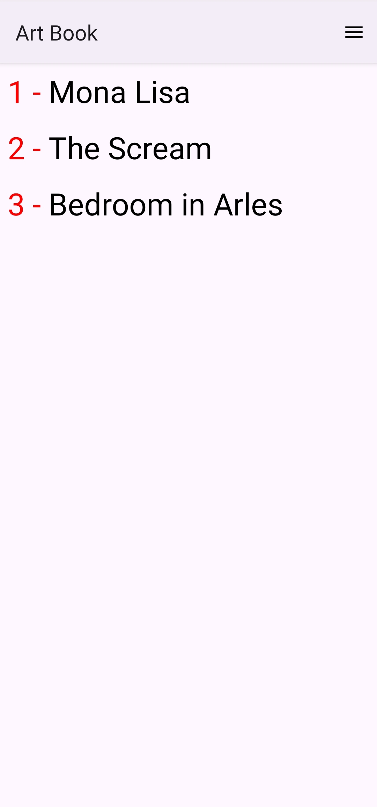
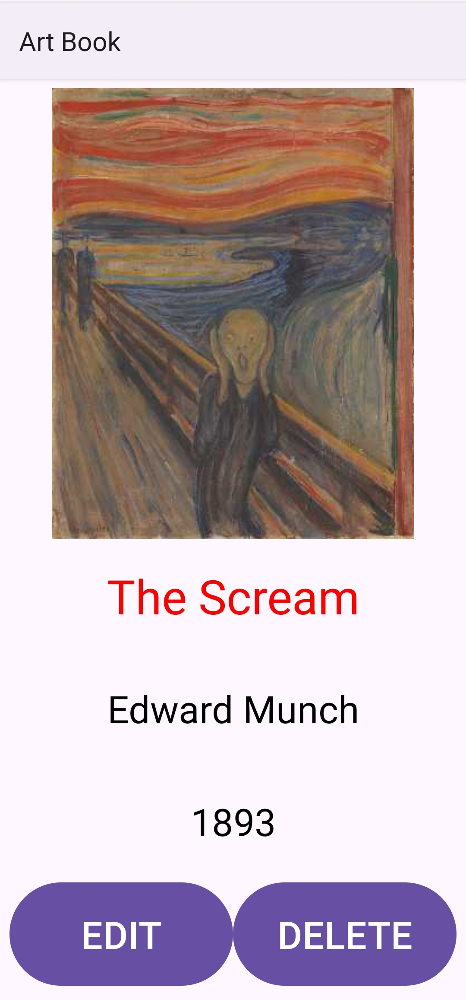
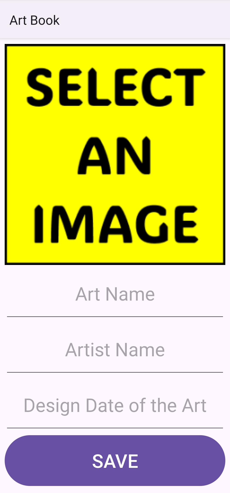

# Art Book (Kotlin • Android)

An Android application written in Kotlin that lets you create a personal catalog of artworks. You can add a piece (title, artist, date, image), view the list, inspect details, edit entries, and delete them. Data is stored locally using a lightweight SQLite table and images are compressed before persistence.

## Features
- Add artworks with name, artist, date, and an image
- Photo selection via Android Photo Picker (API 33+) or legacy gallery with runtime permission
- Image downscaling & JPEG compression for efficient storage
- Local persistence using SQLite (no external ORM; manual SQL + compiled statements)
- List display with `RecyclerView` + custom adapter (`RecyclerAdapter`)
- Detail view with edit & delete actions and confirmation dialog
- Edit flow reuses the add screen pre-populated with existing data
- View Binding enabled for safer, null-free view access
- Responsive image scaling helper to maintain aspect ratio (`makeSmallerImage`)

## Tech Stack
- Language: Kotlin (version 2.2.21)
- Android Gradle Plugin: 8.13.1
- Compile SDK: 36 / Target SDK: 36 / Min SDK: 24
- JVM Target: 21
- UI: AndroidX AppCompat, Material Components, ConstraintLayout, GridLayout (future layout options), RecyclerView
- Data: SQLite (hand-written SQL)
- Architecture: Simple Activities (no fragments); domain model `Art` (POJO + Bitmap)
- Build: Gradle Kotlin DSL with version catalog (`gradle/libs.versions.toml`)

## Project Structure
```
app/src/main/java/com/receparslan/artbook/
  model/Art.kt                 # Data model
  adapter/RecyclerAdapter.kt   # RecyclerView adapter
  view/MainActivity.kt         # Lists artworks from DB
  view/AddingActivity.kt       # Add or edit an artwork, image picker & persistence
  view/DetailActivity.kt       # Shows details, edit/delete actions
```
Resources and view bindings are generated under `app/build/` during compilation.

## Screenshots

| List                                                      | Detail                                                        | Add/Edit                                                     |
|-----------------------------------------------------------|---------------------------------------------------------------|--------------------------------------------------------------|
|  |  |  |

## Data Storage
A single table `arts`:
```sql
CREATE TABLE IF NOT EXISTS arts (
  id INTEGER PRIMARY KEY,
  name VARCHAR,
  artist VARCHAR,
  date VARCHAR,
  image BLOB
);
```
- Insert / update via compiled `SQLiteStatement`
- Images stored as compressed JPEG byte arrays
- Reads performed with raw queries and manual column index resolution

## Image Handling
- Modern (API >= 28 / >= P) decoding with `ImageDecoder`
- Legacy decoding fallback to `BitmapFactory`
- Custom resize maintaining aspect ratio, max dimension 400px
- JPEG compression at ~50% quality to balance clarity and size

## Permissions
- Android 13+ uses Photo Picker (no storage permission)
- Below Android 13 requests `READ_EXTERNAL_STORAGE` with rationale using `Snackbar`

## Setup & Build
1. Clone the repository:
```bash
git clone https://github.com/receparslan4247/Art-Book-Kotlin.git
cd Art-Book-Kotlin
```
2. Open the project in Android Studio (Giraffe+ recommended).
3. Let Gradle sync (Kotlin DSL + version catalog).
4. Run on emulator or physical device (API 24+).

## Running
- Use the Run/Play button in Android Studio.
- Grant gallery permission on devices below Android 13 when prompted.
- Add a few entries; tap to view details; edit or delete from detail screen.

## Potential Improvements
- Migrate to Room for safer persistence & schema management
- Introduce MVVM (ViewModel + LiveData / StateFlow) for lifecycle safety
- Replace Activities with a single Activity + Fragments / Jetpack Navigation
- Add search & filtering
- Export / import (e.g., JSON or share images)
- Dark mode styling & theming

## Dependencies (from version catalog)
| Library | Version |
|---------|---------|
| core-ktx | 1.17.0 |
| appcompat | 1.7.1 |
| material | 1.13.0 |
| activity | 1.11.0 |
| constraintlayout | 2.2.1 |
| gridlayout | 1.1.0 |
| junit (test) | 4.13.2 |
| androidx-junit (androidTest) | 1.3.0 |
| espresso-core (androidTest) | 3.7.0 |

## Contributing
1. Fork the repo
2. Create a feature branch: `git checkout -b feature/your-feature`
3. Commit changes: `git commit -m "Add feature"`
4. Push: `git push origin feature/your-feature`
5. Open a Pull Request

Please keep PRs focused and add screenshots for UI changes.

## License
Licensed under the MIT License. See [LICENSE](LICENSE) for details.

## Disclaimer
All stored artwork images are local to the device and not uploaded remotely. Use responsibly and ensure you have rights to any images added.

---
Feel free to request new features or report issues via the repository's issue tracker.
